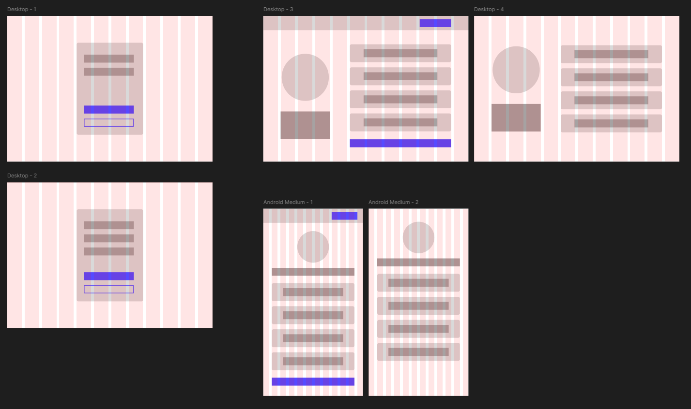

# 🔗 LinkHub – Your Personal Link Hub

**LinkHub** is a minimal and smart personal link hub (like Linktree) built for creators who want a clean, customizable, and no-code experience to manage and share their important links.

This app allows users to create a public profile with curated links, manage them via a drag-and-drop dashboard, and control what appears to their audience.

---

## 🛠 Tech Stack

- **React + Vite + TypeScript** – Modern, fast, and typed frontend setup
- **Context API** – Lightweight global state (auth/session)
- **Material UI (MUI)** – Pre-built UI components for rapid development
- **React Router DOM** – Routing for dashboard and public profile
- **Dnd Kit** – Drag-and-drop support for link reordering
- **Local Storage** – Fake DB for persistence (auth + link data)

---

## ✨ Features

- 🔐 **Authentication System**

  - Register, login, and logout with validation
  - Session management via Local Storage

- 🧰 **User Dashboard**

  - Add, edit, and delete links
  - Drag and drop to reorder links (Dnd Kit)
  - Toggle link visibility (public/private)

- 🌐 **Public Profile Page**

  - Accessible via `/username`
  - Only shows links marked as public

- ⚙️ **Simple & Intuitive UI**
  - Material UI components
  - Responsive design

---

## 📁 Project Structure

```
LinkHub
├─ eslint.config.js
├─ index.html
├─ package-lock.json
├─ package.json
├─ README.md
├─ src
│  ├─ App.tsx
│  ├─ components
│  │  ├─ AuthContainer copy
│  │  │  └─ index.tsx
│  │  ├─ BioInfo
│  │  │  └─ index.tsx
│  │  ├─ LinkListItem
│  │  │  └─ index.tsx
│  │  ├─ LinksList
│  │  │  └─ index.tsx
│  │  ├─ Navbar
│  │  │  └─ index.tsx
│  │  └─ PasswordInput
│  │     └─ index.tsx
│  ├─ constants
│  │  ├─ email.ts
│  │  └─ password.ts
│  ├─ containers
│  │  ├─ AuthContainer
│  │  │  └─ index.tsx
│  │  └─ NotAuthContainer
│  │     └─ index.tsx
│  ├─ index.css
│  ├─ interfaces
│  │  ├─ links.ts
│  │  └─ users.ts
│  ├─ localStorage
│  │  ├─ link.ts
│  │  └─ users.ts
│  ├─ main.tsx
│  ├─ pages
│  │  ├─ Dashboard
│  │  │  └─ index.tsx
│  │  ├─ Login
│  │  │  └─ index.tsx
│  │  ├─ Public
│  │  │  └─ index.tsx
│  │  └─ Register
│  │     └─ index.tsx
│  ├─ store
│  │  ├─ AuthContext.tsx
│  │  └─ LinksContext.tsx
│  ├─ utils
│  │  └─ validation.ts
│  └─ vite-env.d.ts
├─ tsconfig.app.json
├─ tsconfig.json
├─ tsconfig.node.json
└─ vite.config.ts

```

---

## 🧪 How to Run Locally

### 1. Clone the repository

```bash
git clone https://github.com/Andre-ALS/LinkHub.git
cd LinkHub
```

### 2. Install dependencies

```bash
npm install
```

### 3. Start the development server

```bash
npm run dev
```

### 4. Open in browser

Visit `http://localhost:5173`

---

## 🧠 Development Timeline

**1h**

- Designed initial layout and feature scope
- Created GitHub repository
- Bootstrapped project using Vite + React + TypeScript



**2h**

- Researched and selected libraries: Dnd Kit, React Router DOM, Material UI
- Set up application routing

**3–4h**

- Developed login and registration pages
- Implemented full input validation (field-level and on submit)

**5h**

- Created auth system (register/login/logout)
- Integrated with Local Storage for session management

**6–8h**

- Built link management dashboard (add, edit, delete, reorder)
- Persisted user link data using Local Storage (fake DB)

---

## ⚖️ Scope & Trade-offs

### ✅ What’s Included

- Auth and session control using local storage
- Full CRUD for links with drag-and-drop reordering
- Public profile generation by username
- Clean UI using Material UI
- Profile customization (bio, avatar, etc.)

### 🚫 Limitations

- No real backend or database (Local Storage only)
- No analytics or theme customization (possible future work)
- No OAuth provider login (email/password only)

---

## 📌 Future Improvements

- Add user-selected themes (dark mode, brand colors)
- Real backend using Supabase or Firebase
- Link analytics (click tracking)

---

## 📃 License

MIT © André Augusto Lopes dos Santos
